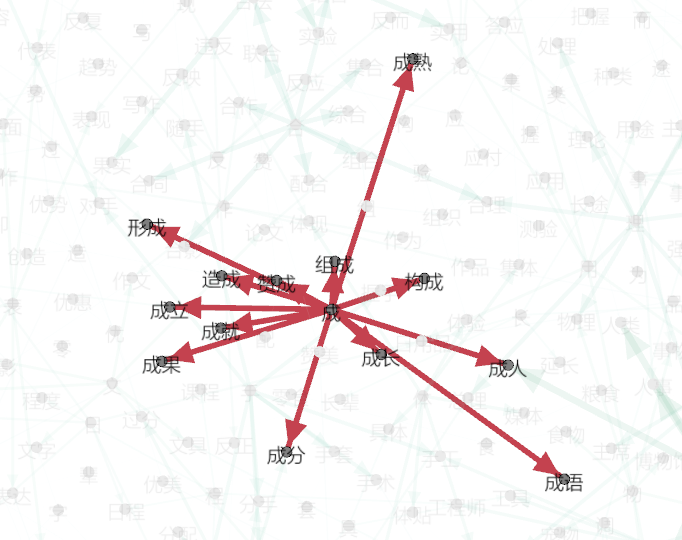

# HSK5 Word Graph

Just a graph representation of the word list for HSK5

hsk5_word_graph.py is a simple python script that builds an adjacency list suitable to be imported by Gephi.

The word list (ordered by frequency) has been taken from http://www.hskhsk.com/word-lists.html

This project has been deeply inspired by the work done in [http://www.hskhsk.com/graphs.html](http://www.hskhsk.com).

